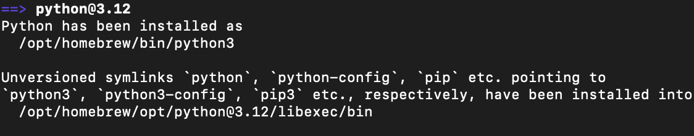

# Howdy!
<br />
I recently purchased a new laptop to help with my education and coding endeavors during my "down time" aka laid off from a tech company.
<br />
So today, I'm starting the process of installing or updating some of my favorite tools, one of which will be Python (version 3.12).🐍
<br />
<br />


We're starting from the *very* beginning here.👩🏼‍🔧 But you have to start somewhere! 
The goal is to get my personal laptop to have all the tools, pipelines, and repositories like I had on my previous work laptop. 

<br />
I'll be following the install via this link: 
<br />
(https://www.geeksforgeeks.org/how-to-download-and-install-python-latest-version-on-macos-mac-os-x/).
<br />
To avoid redundancy, I've only showed my code and copied any instructions that I had issues with or commented on.
<br />
<br />


Anything marked with 🐄 **Hold Up** 🐄  is where I had issues or went a little bit off the path of instructions. 

Anything marked with 🤠**Tidbits**🤠 is helpful info I found out along the way.


# Installing python on Mac M3 Pro, macOS Sonoma v14.4

### Open up terminal:
`Kelsis-MacBook-Pro ~ % `
<br />

🤠**Tidbits**🤠 
<br />
&nbsp;&nbsp;&nbsp;&nbsp;&nbsp;&nbsp;```Kelsis-MacBook-Pro``` is the name of my computer. Your name will be different!
<br />
<br />
<br />
### Start bash:
`Kelsis-MacBook-Pro ~ % /bin/bash`


<br />


### Install homebrew by running these lines of code:


`bash-3.2$  /bin/bash -c "$(curl -fsSL https://raw.githubusercontent.com/Homebrew/install/HEAD/install.sh)"`


`bash-3.2$ (echo; echo 'eval "$(/opt/homebrew/bin/brew shellenv)"') >> /Users/kw/.zprofile`


`bash-3.2$     eval "$(/opt/homebrew/bin/brew shellenv)"`
<br />
<br />
### Open a new terminal and run these lines of code to add brew to your profile:

```Kelsis-MacBook-Pro ~ % (echo; echo 'eval "$(/opt/homebrew/bin/brew shellenv)"') >> /Users/kelsiowest/.zprofile``` 
<br />


🤠**Tidbits**🤠 
<br />
&nbsp;&nbsp;&nbsp;&nbsp;&nbsp;&nbsp;Your user name should go where `kw` is.
<br />


```Kelsis-MacBook-Pro ~ % eval "$(/opt/homebrew/bin/brew shellenv)"```

Use Brew to now install Python 3.12:
<br />
`Kelsis-MacBook-Pro ~ % brew install python`
`Kelsis-MacBook-Pro ~ % python3 --version`
`Python 3.9.6`

🐄**Hold Up**🐄
<br />
&nbsp;&nbsp;&nbsp;&nbsp;&nbsp;&nbsp;You will see that when I do `Kelsis-MacBook-Pro ~ % python3 --version`, it gives me`Python 3.9.6`. 
<br />
&nbsp;&nbsp;&nbsp;&nbsp;&nbsp;&nbsp;This is because the default version installed on a Mac is Python 3.9. 
<br />
&nbsp;&nbsp;&nbsp;&nbsp;&nbsp;&nbsp; But the version we just install through `brew install` was Python 3.12, as shown in our terminal.


&nbsp;&nbsp;&nbsp;&nbsp;&nbsp;&nbsp;In order to access the Python 3.12 we just installed we can do two things:
<br />
&nbsp;&nbsp;&nbsp;&nbsp;&nbsp;&nbsp; 1. Call Python 3.12 by simply using `python3.12` 
<br />
&nbsp;&nbsp;&nbsp;&nbsp;&nbsp;&nbsp; 2. Change the default `python3` or `python` command to redirect to our newly installed Python 3.12. 

&nbsp;&nbsp;&nbsp;&nbsp;&nbsp;&nbsp;Because lots of different codebases and Git repositories require different versions of python, 
<br />
&nbsp;&nbsp;&nbsp;&nbsp;&nbsp;&nbsp;for my use case, I'm fine with just using `python3.12` if that version is needed and I can call `python3` if I need the default version 3.9. 


Overall, I'm surprised how smoothly that went. Probably because I don't have any other junk or dependencies to mess things up yet! All in due time.🕸️


