# Howdy!
<br />

&nbsp;&nbsp;&nbsp;&nbsp;&nbsp;&nbsp;As with any good experiment, I've tried AIHawk several different times to see differences and adjust parameters to narrow the positions it applies to. 

&nbsp;&nbsp;&nbsp;&nbsp;&nbsp;&nbsp;If you haven't seen my original post on AIHawk, including a walk through installation and modifying files with all my 🤠**Tidbits**🤠 and 🐄**Hold Ups**🐄, find it here: 
https://github.com/kelsiwest-binf/recapitulate_this/blob/main/_posts/How_Well_Will_LinkedIn_AIHawk_Work.md

---
<br />

### LinkedIn_AIHawk

#### 🤖🔍 Your AI-powered job search assistant. Automate applications, get personalized recommendations, and land your dream job faster.
Find it here:
https://github.com/feder-cr/linkedIn_auto_jobs_applier_with_AI?tab=readme-ov-file

---
<br /><br />
Anything marked with 🐄**Hold Up**🐄  is where I had issues or went a little bit off the path of instructions. 
<br />
Anything marked with 🤠**Tidbits**🤠 is helpful info I found out along the way.
<br />
<br />

# Attempt #1
&nbsp;&nbsp;&nbsp;&nbsp;&nbsp;&nbsp;In my first attempt, this is what the `positions` in the config.yaml file looked like:
<br />

```yaml
positions:
  - Senior Bioinformatics Scientist
  - Lead Bioinformatics Scientist
  - Computational Biologist
  - Senior Computational Biologist
  - Applied Computational Biologist
  - Bioinformatics Scientist
  - Bioinformatician
  - Bioinformatics Engineer
  - Senior Scientist
```
&nbsp;&nbsp;&nbsp;&nbsp;&nbsp;&nbsp; When the program starts, my terminal displays messages stating where it is in the process: 
<br />
<br />
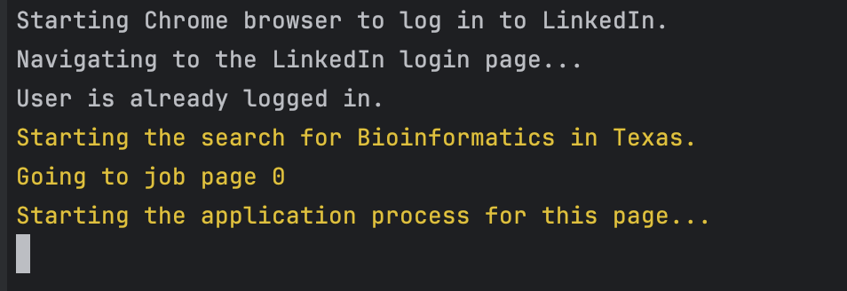
<br />
<br />
&nbsp;&nbsp;&nbsp;&nbsp;&nbsp;&nbsp;On this first attempt, I used my custom resume and not the AI generated option.
<br />
<br />
&nbsp;&nbsp;&nbsp;&nbsp;&nbsp;&nbsp;I did not receive any warning messages or errors. WHOOP!

🐄**Hold Up**🐄  
<br />
I did find out that **AIHawk only applies to Easy Apply jobs on LinkedIn.** 
This means that any kind of application that is not Easy Apply, AIHawk will not be able to apply to those positions. 
<br />
<br />
&nbsp;&nbsp;&nbsp;&nbsp;&nbsp;&nbsp;With all the positions I listed above, it took AIHawk several hours to complete running. 
<br />
&nbsp;&nbsp;&nbsp;&nbsp;&nbsp;&nbsp;From all of that, it only applied to 3 jobs, which I would consider "mildly" related, but not the job titles I had used. 

&nbsp;&nbsp;&nbsp;&nbsp;&nbsp;&nbsp;I received emails everytime a job was applied for. See below. 

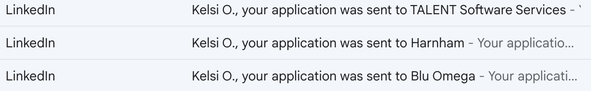

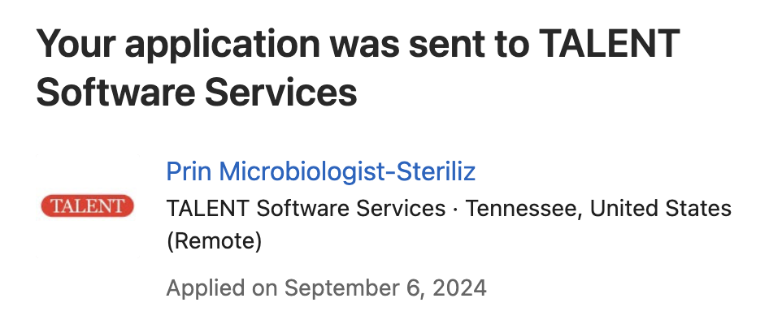
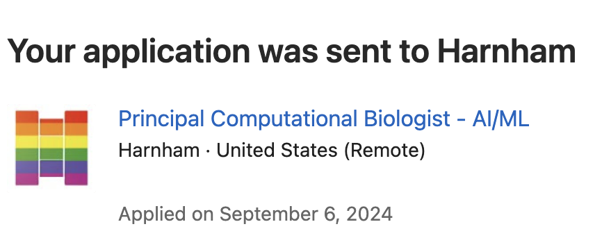
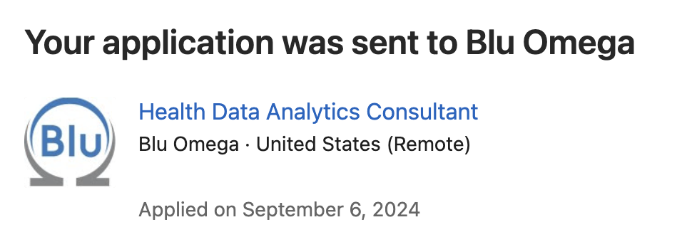

🤠**Tidbits**🤠
<br />
&nbsp;&nbsp;&nbsp;&nbsp;&nbsp;&nbsp;Now, the Principal Computational Scientist was the only position I considered relevant to my job search. 
&nbsp;&nbsp;&nbsp;&nbsp;&nbsp;&nbsp; 1 out of 3 isn't bad for something I did not have to do, but I do feel as I am contributing to the already huge problem of people applying and "junking" up HR inboxes of positions they aren't qualified or interested in to just hurt other more qualified candidate's chances. 
<br />
<br />

# Attempt #2
&nbsp;&nbsp;&nbsp;&nbsp;&nbsp;&nbsp; For my second attempt, I wanted to see what, if any, difference using the AI generated resume option would have. 
<br />
<br />
&nbsp;&nbsp;&nbsp;&nbsp;&nbsp;&nbsp; I used the same `position` list as above. As soon as I got the first email, I went to find what the resume actually looked like.
<br />
<br />
&nbsp;&nbsp;&nbsp;&nbsp;&nbsp;&nbsp; I did this by going to the "Jobs" section on LinkedIn and clicking on the "Applied".

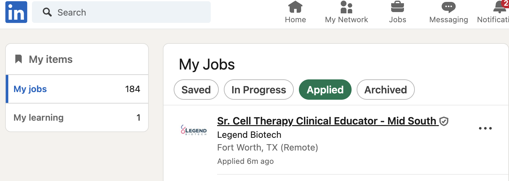

&nbsp;&nbsp;&nbsp;&nbsp;&nbsp;&nbsp;From this, you can click on the "Submitted Resume" and it will download the resume used to apply to that position. 
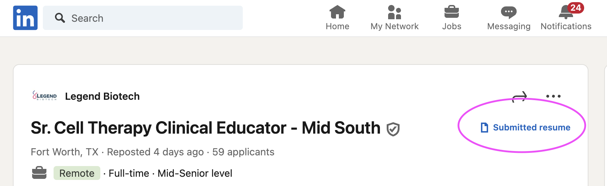

<br /><br />

### Big Reveal
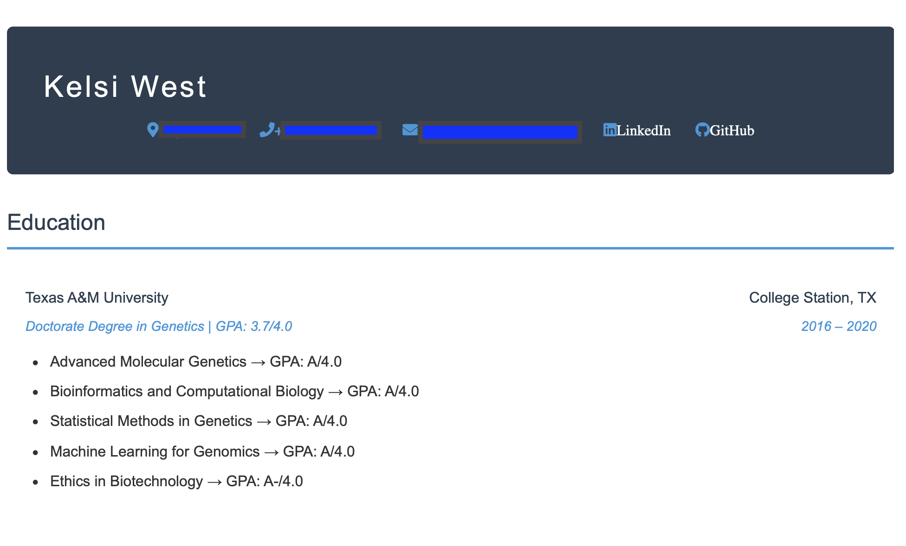
<br />
<br />
*insert disappointed trumpet noise here*

<br />
<br />
🐄**Hold Up**🐄 
<br />
&nbsp;&nbsp;&nbsp;&nbsp;&nbsp;&nbsp; We are dealing with some AI hallucination issues here because I never told it anywhere that I had those courses, nor did I ever get an "A" in those courses. 
Besides the fact that it's not as beautiful as my personal resume that I spent hours on. 
<br />
<br />

### My Real Resume
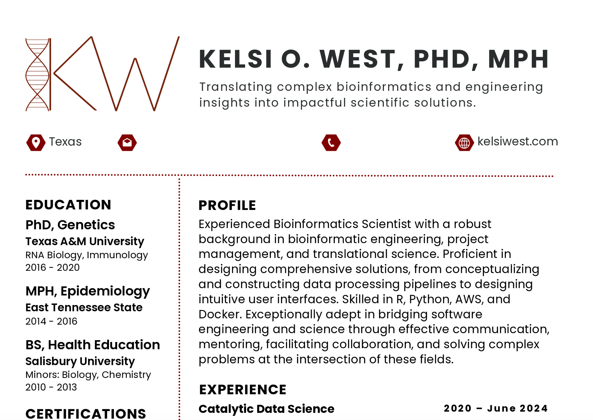
<br />

&nbsp;&nbsp;&nbsp;&nbsp;&nbsp;&nbsp;You may now see why I will now always go with the option of loading my own resume.
&nbsp;&nbsp;&nbsp;&nbsp;&nbsp;&nbsp;I will say that this can be a great jumping off point for a person who may not have time to generate a resume or wants a starting place to generate their resume!
&nbsp;&nbsp;&nbsp;&nbsp;&nbsp;&nbsp;On Attempt #2, it applied to a couple of jobs before I stopped the process due to the resume format. 
&nbsp;&nbsp;&nbsp;&nbsp;&nbsp;&nbsp;These jobs were `Data Scientist` positions. 

&nbsp;&nbsp;&nbsp;&nbsp;&nbsp;&nbsp;`Data Scientist` is an interesting title that sometimes applies to me and most times does not. 
&nbsp;&nbsp;&nbsp;&nbsp;&nbsp;&nbsp;I think in my future attempts, I will add it to the `config.yml` file as part of the `titleBlacklist:` that is supposed to not apply for jobs with those titles. 

&nbsp;&nbsp;&nbsp;&nbsp;&nbsp;&nbsp;This may also be because of the number of `positions` I have listed in my `config.yml` file. I think I will also start to limit those. My "Senior Scientist" title is probably much too vague, so I will remove that. Perhaps since it's two words in the position, it reads both and applies to any relevant position within those two words e.g. "Computational" or "Scientist"

&nbsp;&nbsp;&nbsp;&nbsp;&nbsp;&nbsp;I have modified my blacklist to:
```yaml
titleBlacklist:
  - Sales
  - Application
  - Marketing
  - Data Scientist
  - Analyst
```
<br />
<br />

# Attempt #3

&nbsp;&nbsp;&nbsp;&nbsp;&nbsp;&nbsp;For this attempt, I launched AIHawk on a Thursday afternoon. 
&nbsp;&nbsp;&nbsp;&nbsp;&nbsp;&nbsp;I had the `titleBlacklist` above and the same `positions` I kept from the beginning. 
&nbsp;&nbsp;&nbsp;&nbsp;&nbsp;&nbsp;Within minutes, I had several emails to applications that had been sent. 

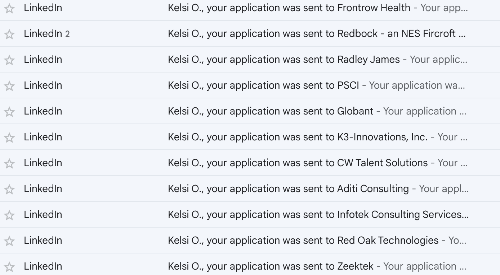

&nbsp;&nbsp;&nbsp;&nbsp;&nbsp;&nbsp;I was hopeful, yet suspicious, that so many positions would be relevant to my job experience or `positions` I had listed. Especially given that I have been applying to jobs on my own since January. 

&nbsp;&nbsp;&nbsp;&nbsp;&nbsp;&nbsp;Upon further inspection my suspicions were confirmed. Here are a handful of the jobs that AIHawk applied for:
<br />
<br />
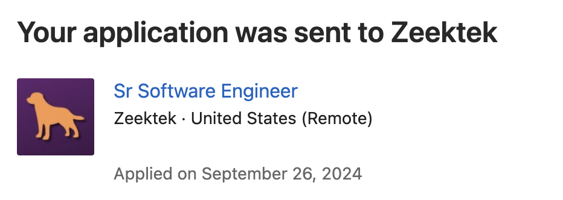
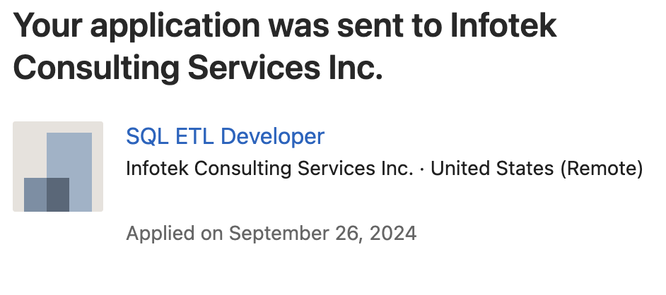
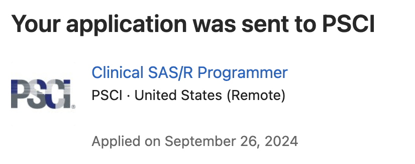
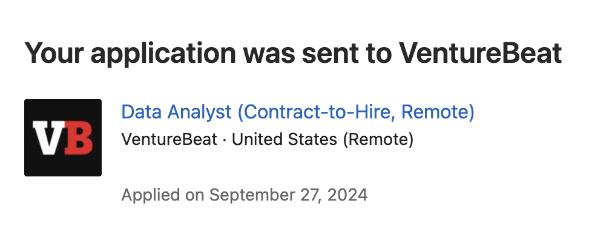

<br />
<br />
&nbsp;&nbsp;&nbsp;&nbsp;&nbsp;&nbsp;I will say that I was instantly mortified when I saw that it applied to the `Sr Software Engineer`. Even upon looking at the job description, there was nothing even related to Bioinformatics whatsoever. 
<br />
&nbsp;&nbsp;&nbsp;&nbsp;&nbsp;&nbsp; I would say the most relevant from the handful of positions above would be the Clinical SAS/R Programmer. But nowhere do I have `Clinical` or `Programmer` in my `positions`. I'm still a bit thrown-off on how it applied to most of these.
<br />
&nbsp;&nbsp;&nbsp;&nbsp;&nbsp;&nbsp; From this information, I decided to add more to my `titleBlacklist` and limit my `positions` extremely. 
<br />
&nbsp;&nbsp;&nbsp;&nbsp;&nbsp;&nbsp;I have modified my blacklist to:

```yaml
titleBlacklist:
  - Sales
  - Application
  - Marketing
  - Programmer
  - Software Engineer
  - Data Scientist
  - Data Analyst
```
I have since limited my desired positions to:
```yaml
positions:
  - Senior Bioinformatics Scientist
  - Computational Biologist
  - Bioinformatics
```
<br />
<br />
&nbsp;&nbsp;&nbsp;&nbsp;&nbsp;&nbsp; I will say that running with the above adjustments, led to a much narrower pool of applications. It's not AIHawk's fault there are not positions for those titles, and it seemed way more accurate in searching for those specific positions only. 
<br />
<br />

# Final Review
&nbsp;&nbsp;&nbsp;&nbsp;&nbsp;&nbsp; AIHawk is a convenient, easy-to-use CLI tool, to apply to certain job types on LinkedIn.

<br />
&nbsp;&nbsp;&nbsp;&nbsp;&nbsp;&nbsp; As with all things code, this is a game of troubleshooting to really narrow in AIHawk on the positions you want to apply for.
<br />
&nbsp;&nbsp;&nbsp;&nbsp;&nbsp;&nbsp; I would say more than any other of the categories, `positions` and `titleBlacklist` inside the `config.yml` are most important for having AIHawk apply to positions that are most relevant.
<br />
&nbsp;&nbsp;&nbsp;&nbsp;&nbsp;&nbsp; From my experience, it helps to switch up the days you run the program. One attempt I have had 3 applications sent and on other days I've had 12. Again, they were not all relevant, but some were! You could even just have this set up to run when you opened your computer. All it takes is one line of code to run after you have all the files filled out!
<br />

&nbsp;&nbsp;&nbsp;&nbsp;&nbsp;&nbsp; I **really** wish it applied to jobs outside the Easy Apply, but I do see the limitations with that (e.g. job specific questions, third party log-in, additional files required, etc.). 
<br />
&nbsp;&nbsp;&nbsp;&nbsp;&nbsp;&nbsp; Maybe we could use AI to solve that but then again, maybe we would just have hallucination issues as above. 
&nbsp;&nbsp;&nbsp;&nbsp;&nbsp;&nbsp; As always, I would like to give a hats off to the creators, feder-cr and AIHawk for publishing this tool and more importantly, having thorough instructions for users to follow along and make use of this tool!
<br />
<br />


